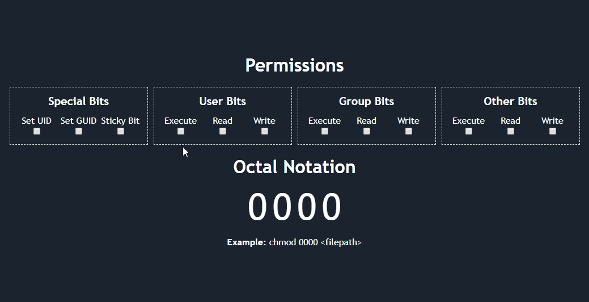
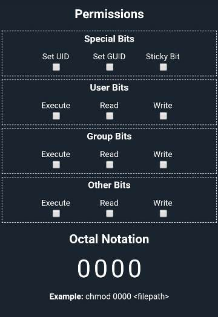

# Linux Permissions Calculator

This is a simple webapp to find the flag values used with the chmod command in linux. The user can find the appropriate value of the flags by checking what permissions are needed. This project was bootstrapped with [Create React App](https://github.com/facebook/create-react-app).

## Other Packages Used

1. [animated-number-react](https://www.npmjs.com/package/animated-number-react): Used to animate the flag value when it changes.

## Available Scripts

In the project directory, you can run:

### `npm start`

Runs the app in the development mode. 
Open [http://localhost:3000](http://localhost:3000) to view it in the browser.

The page will reload if you make edits. 
You will also see any lint errors in the console.

### `npm run build`

Builds the app for production to the `build` folder. 
It correctly bundles React in production mode and optimizes the build for the best performance.

The build is minified and the filenames include the hashes. 
Your app is ready to be deployed!

See the section about [deployment](https://facebook.github.io/create-react-app/docs/deployment) for more information.

## Screenshots

### Desktop

### Mobile

